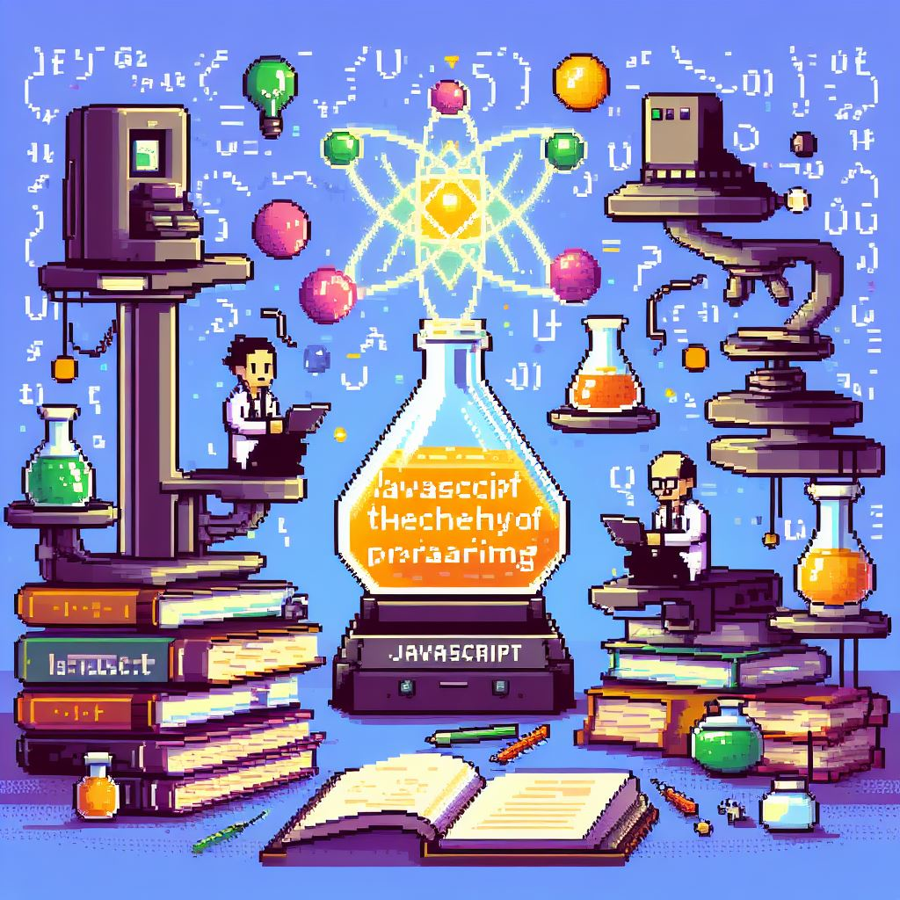

    

-------

# Projeto EBOOK Gerado por I.A.s

 > ℹ️ **NOTE:** Este é o repositório desenvolvido durante o curso no qual fui instrutor técnico na plataforma da [DIO](https://dio.me)

Projeto com o objetivo de gerar um ebook digital com as facilidades das ferramentas de IA. todos os prompts
seguem abaixo.

<a href="https://github.com/AlineGpp/prompts-recipe-to-create-a-ebook/blob/main/output/eBook.pdf" title="View PDF now"> 📕Clique aqui para ler</a>

## 💻 Tecnologias utilizadas no projeto

- [ChatGPT](https://chat.openai.com/) 
- [MidJourney](https://www.midjourney.com/app/)
- [PowerPoint](https://www.microsoft.com/en/microsoft-365/powerpoint)

## 🧠 Prompts

ChatGPT：

|   Ação   | prompt                                                                                                                                                                                                                                                                         |
| :------: | ------------------------------------------------------------------------------------------------------------------------------------------------------------------------------------------------------------------------------------------------------------------------------ |
|  título  | Crie um título de um ebook sobre o tema javascript, o ebook é do nicho de programação e o subnicho é de javascript, o título deve ser épico e curto, e tenha uma temática nerd no título, me liste 5 variações de titulo                                                        |
| conteúdo | faça um texto para ebook, com foco em Javascript , listando como usar as variáveis em em javascript e com exemplos de código   
{REGRAS}|

## ✨ Features

- Conteúdo gerado via ChatGPT
- Imagens geradas via MidJourney

## 📚 Materiais

- Imagens utilizadas em `assets`
- ebook gerado durante as aulas em `output`

## 🛠️ Instruções de execução

Utilize os prompts acima nas ferramentas sugeridas para gerar o material base e utilize uma ferramenta de edição de documentos como power point, libreoffice , indesign para diagramação.

## 👨‍💻 Expert

    
    
&nbsp&nbsp&nbspAline Goppinger 
    &nbsp&nbsp&nbsp
    <a href="https://github.com/AlineGpp">
    GitHub</a>&nbsp;|&nbsp;
    <a href="https://www.linkedin.com/in/aline-goppinger-ab94b7218/">LinkedIn</a>
&nbsp;|&nbsp;
&nbsp;

  

---

⌨️ com 💜 por [Aline Goppinger ](https://github.com/AlineGpp)